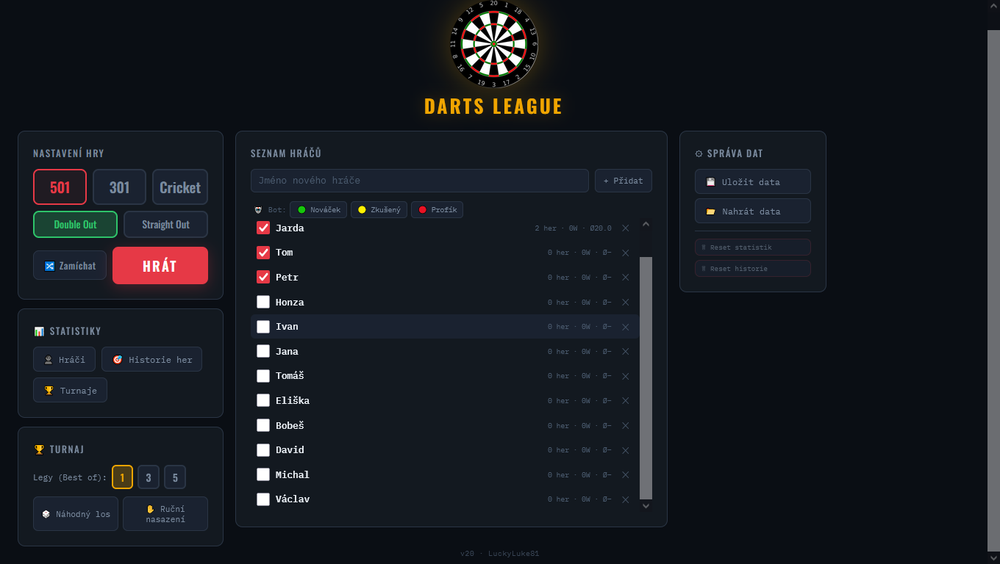

🎯 Darts League – Šipkový zapisovač

Jednoduchý offline zapisovač šipek vytvořený jako hobby projekt pro hraní v hospodě na notebooku.

Vzniklo to z jednoduché potřeby – chtěli jsme hrát šipky bez reklam, bez internetu, bez registrací a bez složitostí.
Nenašli jsme nic, co by nám vyhovovalo.
Tak vzniklo tohle.

Jeden HTML soubor.
Funguje offline.
Žádné instalace.
Žádné reklamy.
Žádné sledování.

🕹 Co aplikace umí

Hra 301 / 501 (včetně dohozů a bust pravidel)

Cricket

Turnajový pavouk

Vestavění boti (různé obtížnosti)

Statistiky hráčů

Historie zápasů

Hlasové hlášky (čeština)

Funguje na notebooku, tabletu i mobilu

Vše běží čistě v prohlížeči.

📱 Podpora zařízení

Aplikace je navržena tak, aby fungovala:

na notebooku

na tabletu

na mobilním telefonu

Rozhraní je responzivní a bylo záměrně upraveno tak, aby bylo pohodlně použitelné i na menších obrazovkách.

Otestováno v běžných moderních prohlížečích.

📦 Jak to použít

Stáhni soubor Darts-League.html

Otevři ho v libovolném moderním prohlížeči

Hraj

Hotovo.

Není potřeba nic instalovat.

💾 Ukládání dat

Aplikace umožňuje export a import dat ve formátu JSON.

Ukládají se například:

statistiky hráčů

historie zápasů

turnaje

Data nejsou nikam odesílána.
Vše probíhá lokálně v prohlížeči.

Uživatel si může kdykoliv vytvořit zálohu pomocí exportu JSON souboru
a později ji znovu načíst pomocí importu.

To umožňuje:

přenést data na jiný počítač

vytvořit si vlastní zálohu

sdílet statistiky s ostatními

🌍 Jazyk

Aplikace je kompletně v češtině včetně hlasových hlášek.
Projekt je primárně určen pro české hráče.

🔢 Verze

Toto je první veřejné vydání na GitHubu.

Ve skutečnosti je aplikace výsledkem dlouhodobého vývoje a interně se jedná přibližně o verzi 20.

Na GitHubu je tato verze označena jako:

v1.0.0

Veřejné verzování začíná od této chvíle.

🎯 Proč jeden HTML soubor?

Protože jednoduchost je vlastnost.

žádný build systém

žádné závislosti

žádný backend

žádné účty

Stačí otevřít a hrát.

📜 Licence

Projekt je zdarma k použití.

Pokud si ho upravíš nebo vylepšíš, klidně si ho forkni.
